# ReNow (Apollo level)

ReNow is a public marketplace for home services. The range of home services that the marketplace covers includes but is not limited to:

- Repairs  
- Renovation  
- Installation  
- Cleaning  

ReNow is primarily built on the following tech stack:

- **React Native (JavaScript)** for designing the application  
- **Expo** for deployment  
- **Supabase** for backend and database management  

## Problem motivation

Ever had broken plumbing, appliances or made a dent in the wall and not knowing how to fix them? These things happen rather often and the solutions may not be readily available to most people. The services providers for these problem may be hard to find mainly due to the fact that owners of such businesses might not be internet-savvy enough to publish their adverts online. Many times, home service providers rely on door-to-door marketing (e.g. fridge magnets, posters) which incurs high advertising and logisitcal cost and lower reach.

The pricing for these services may also vary heavily while not being standardised. Due to the minimal online presence by providers, home owners do not have the full picture of the prices available to them and are unable to come to an informed choice when deciding which option best suits their needs.

Currently, there are websites where you can find specific services (e.g. renovation). But, how about one app to rule them all? Here we would be able to access all sorts of home fixing services and even renovation services. Freelancers could also use this app to offer and accept requests. This app enables both home owners and home service providers to access better resources to source for services and clients.

## Core features

The Renow app will be equipped with a myriad of features that helps to smoothen the process of finding and delivering home services. Our features include:

- Allowing home owners to upload their requests
- Allowing home service providers to upload the services that they offer
- Enabling the modification and deletion of posting
- Enabling image uploads for providers to assess the issue readily
- A proof of completion will be generated for completed listing in the event of disputes.
- Allowing users to schedule their meeting
- A personal calendar for users to track their schedule
- Allowing users to write reviews their experience
- A rating system for users to rate their experience
- Type matching capability and Price matching capability through filtering
- Search function

## Design planning

Renow aims to take inspiration from successful marketplace applications (such as Shopee, Carousell etc.) to provide our users with the best experience when using our app.

We also plan to rely heavily on Custom components instead of native react components to ensure that both Android and IOS users will enjoy the same experience when using our app.

---

# Table of Contents

## Getting Started
- Accessing the App
  - Android Users
  - iOS Users

## User Authentication
- Signing Up
- Logging In

## Main Navigation
- Main Tabs of ReNow
  - Home
  - Listing
  - Create Listing
  - Profile

## Home Screen
- Overview
- Requests
- Services

## Filtering System
- Search bar
- Price Matching
- Type Matching

## Listing Management
- Listing Screen Overview
- My Listing
- Accepted Listing
- Claimed Listing

## Create Listing
- Inputs overview
- Image upload
- Scheduling

## Profile Management
- Profile Overview
- Completed Listings
- My Reviews
- Personal Calendar
- Logging Out


## Software Engineering Practices
- Architecture & Design Patterns
- Code Organization & Structure
- Error Handling & Validation
- Performance Optimization

## Testing
- User testing
- Unit testing
  
---

# Accessing the App

## Android users

For android users, the steps are quite simple, albeit you need to allow for the installation of unknown apps through the web.

1. **Download the APK**
   - Visit the following link to download the latest RenowApp APK file:
     - [Download RenowApp APK](<https://expo.dev/accounts/coderkee/projects/renowapp/builds/9cd371e7-9ad9-4cfd-8e14-349272f3d60e>)
   - If prompted, allow your browser to download files from unknown sources.

2. **Install the APK**
   - Once the download is complete, open the APK file from your device's Downloads folder.
   - If this is your first time installing an app outside of the Google Play Store, you may need to enable installation from unknown sources:
     - Go to **Settings > Security** (or **Settings > Apps & notifications > Special app access > Install unknown apps**).
     - Select your browser or file manager and enable **Allow from this source**.
   - Follow the on-screen prompts to complete the installation.

3. **Open RenowApp**
   - After installation, tap the RenowApp icon on your home screen or app drawer to launch the app.

4. **Sign Up or Log In**
   - Create a new account or log in with your existing credentials to start using RenowApp.

> **Note:** The app is currently available for Android only. If you encounter any issues during installation, please email us.

## IOS users

Renow currently do not support native IOS application. Hence, it is recommended that users download **Android Studio** to access the Renow app. Please follow the download guide below.

### Install Android Studio

Visit the [official Android Studio download page](https://developer.android.com/studio).  
Download the installer for your operating system.  
Follow the on-screen instructions to complete the installation.  
Ensure you install the Android Emulator and Android Virtual Device (AVD) Manager during setup.

### Launch Android Studio

Open Android Studio.  
If it’s your first time, complete the setup wizard.

### Open or Create a Project

**Create a new project:**
- Go to **File → New → New Project…**
- Choose a template (like **Empty Activity**), click **Next**.
- Fill in project name and location.
- Click **Finish**.

**Or open an existing project**.

### Open the AVD Manager

In the top-right corner, look for the **Device Manager** icon (smartphone icon) and click it.  
Alternatively, go to **Tools → Device Manager**.

### Create a New Virtual Device

In the **Device Manager**, click **“+ Create device”**.  
Select a hardware profile (e.g., Pixel 7, Nexus 5X), then click **Next**.

### Select the System Image

You’ll see a list of system images (Android OS versions).  
If needed, download the image by clicking the **Download** link.  
Once downloaded, select the image and click **Next**.

### Configure the Emulator

In the **AVD configuration window**:
- Set the name (or keep the default).
- Choose portrait or landscape orientation.
- Adjust RAM, storage, etc. under **Advanced Settings** (optional).

Click **Finish** to create the emulator.

### Launch the Emulator

In the **Device Manager**, find your newly created emulator. 
Click the play (▶️) button to start the emulator.  
Wait a few seconds as it boots up.

### Running Renow

Users can now treat the emulator as their personal **Android** phone.  
Please follow the guide on how to run the Renow App for **Android users**

---

# Signing Up

To sign up into ReNow, users can click on the highlighted **Don't have an Account? Sign Up** text which will bring the user to a **Sign Up** Screen.

The **Sign Up** screen will require 3 text inputs: Username, Password, and Confirm Password. Users should fill in all text inputs.

- Username should be at least 4 letters long  
- Password should be at least 8 letters long  
- Confirm Password must match Password exactly  

The failure to meet any of the 3 requirements will result in a corresponding error message

Upon filling the text inputs, users should click on the **Sign Up** button.  
(Note that failure to fill in the 3 aforementioned text inputs will result in an error message asking users to fill in all the required fields.)

After successfully filling in all 3 text fields users will be redirected to a **Log in** screen

The interface of the sign up screen is shown below for user reference:

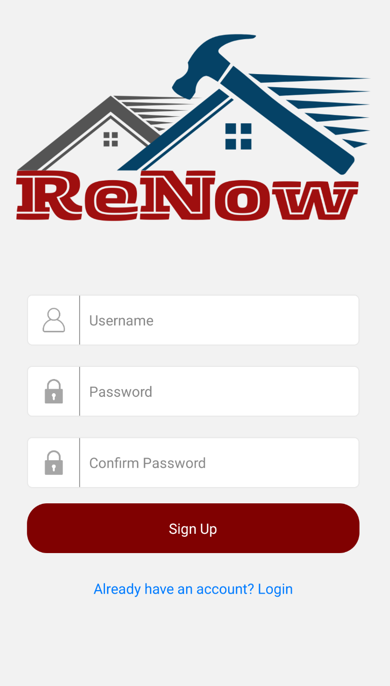

## Developers' note

Currently, the username and password will be passed into 'Users' table in Supabase, for this project, we are not using Supabase's authentication system.  

This decision is made in part that that Supabase 's authentication system requires a valid email address and we are aware that some testers might not feel safe with using their own email address for this project.

However, for developers who wishes to use Supabase authentication, we have commented out a section of a code that uses Supabase authentication, please replace the code with the commented code.

---

# Logging in

On the **Log in** screen, users will see 2 text input boxes, 

- Username
- Password

Users should fill in both text inputs with the corresponding username and password that they signed up with
(Note that failure to do so will prompt an error message to states that username and password do not match)

After successfully filling in the text inputs, users should click on the **Log in** button which will direct users to the **Home** tab

The interface of the log in screen is shown below for user reference:

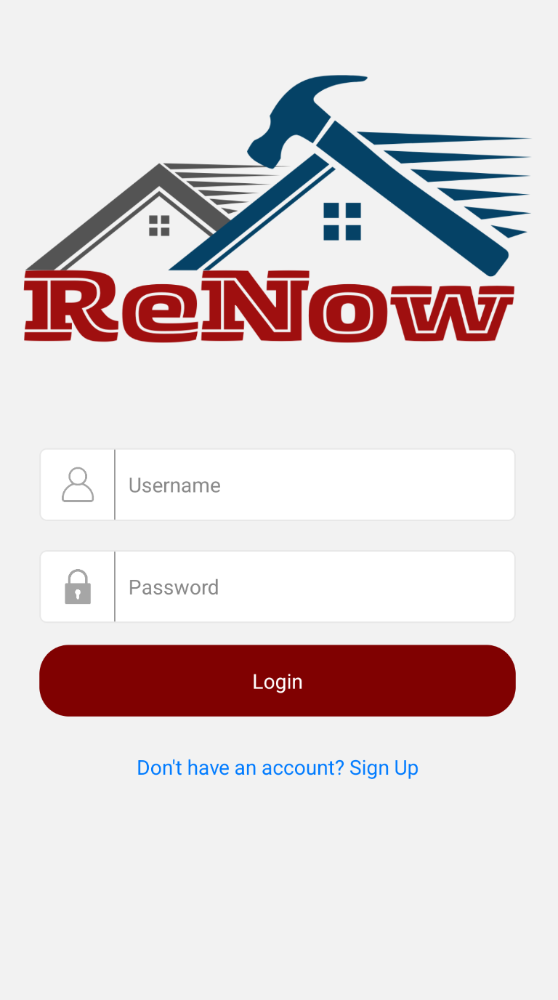

---
# Main tabs of Renow

There is a total of 4 main tabs in Renow

- Home
- Listing
- Create Listing
- Profile

Users should be able to see the available options at the bottom of their screen.

The interface for the main tabs is shown for user reference:


# Home

The **Home** Screen is the first screen the user sees upon logging in. It is mainly used for viewing Listings made by other users(as well as the user) and also to accept any requests or services.

In the **Home** Screen, there are 2 other tabs separated by a top tab, HomeRequest and HomeService, for Requests and Services respectively. Furthermore, any Listing can be expanded upon to be viewed in
greater detail in another screen called ItemDetails.

This section walks through:

- Purpose and key features  
- User flow
- Error handling
- Backend data handling with Supabase

Developers' note: **Home** 's file is located in HomeScreen.js. The two tabs are HomeRequest.js and HomeService.js respectively. The detailed item screen is ItemDetail.js

## Purpose and key features

As mentioned previously, the **Home** screen is mainly used for user to view Listings. It supports the following operations
- Viewing of Listings in its condensed form
- Viewing of Listings in detailed form
- Seperation of Requests and Services
- A search bar to find Listings based on name (to be implemented)
- A filter button/function to filter Listings based on specific requires (to be implemented)
- A calender in the detailed view to facilitate scheduling (to be implemented)
- Storing and updating Listings using supabase

(Refreshing can be done manually or upon entering the page each time)

Both postings for requests and services will be arranged based on the most recent date of creation.

Since Renow is a global marketplace, requests/services may be uploaded at any moment. Hence, it is recommended that users periodically refresh to see the latest requests/services.

## User flow

The user will navigate to the **Home** screen by default after logging in, otherwise they can simply tap on the Home tab on the bottom tabs to navigate to **Home**.

Upon entering the **Home** page the user will see 2 different tabs on top, Request and Service, as well as a bunch of Listings represented as an Item Card.
An Item Card contains the following:
- Listing image
- Title
- Type (Cleaning, Repair, etc...)
- Price
- Brief description
- A view button

If the user wishes to view the Listing, they may click on the **View** button to bring them to the detailed view, which is a page on top of the **Home** screen

In the detailed view, the user may see the previously mentioned information with an addition of:
- An image carousel that contains images uploaded by the poster
- Clickable username of the author
- Detailed Description
- A calendar for the user to choose a date
- An accept button

Any user can click on the accept button to accepted any Listing(except their own), after which they will be prompted to confirm their decision through a modal.
Upon confirmation of acceptance, to user will be brought to their **Accepted Listing** Screen.

Users can also click on the author of listing (the username should be highlighted in blue)

Upon clicking on the author's username, it should display a pop-up modal consisting of past reviews of the author.

If the user views their own Listing in detail, the accept button is greyed out an clicking it will do nothing.

The interface for Item Details is shown below for user reference:

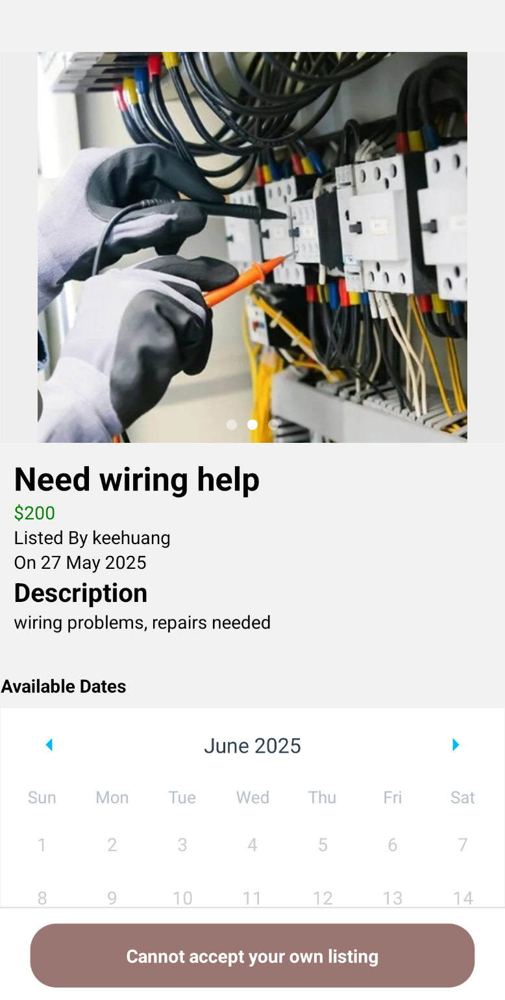

## Error handling

Note that most error handling is done during the **Create Listing** section to ensure that all the necessary information are provided to display a smooth listing section and item details.

If a user tries to accept their own listing, the button will do nothing(coded as onPress={null}). In fact, the button is greyed out for any cases where the user is unable to accept the request.

## Backend data handling with Supabase

  **Step 1:**
  After logging in, the user is brought to the **Home** screen.

  **Step 2:**
  The app then takes all Listings from supabase(all is taken but only 5 will be shown at a time). If the user scrolls further down, more Listings will be generated, 5 at a time.
  
  **Step 3:**
  Each Listing is then displayed as an Item Card with the option to view the Listing in detail. The details of the listing is retrieved from supabase

  **Step 4:** 
  Once in the page, the user may choose the accept the Listing
  
  **Step 5:**  
  After the user accepts the request, supabase updates the Listing with the name of the acceptor and sends the user to the Accepted Listing Screen to view their List of accepted Listings

# RenowApp Filtering System

A comprehensive filtering and search system for the RenowApp marketplace, enabling users to efficiently find service listings and requests through multiple criteria.

## Overview

The filtering system provides a robust search and filter functionality for both service offerings and service requests in the RenowApp marketplace. Users can search by text, filter by service type, and set price ranges to find exactly what they're looking for.

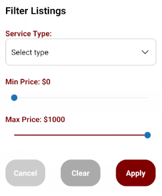

## Features

### Text Search
- **Real-time search**: Search listings by title with instant results
- **Case-insensitive**: Search works regardless of text case
- **Clear functionality**: Easy-to-access clear button (X) to reset search

### Service Type Filtering
- **Predefined categories**: Choose from Cleaning, Installation, Renovation, Repairs, or Others
- **All option**: View all listings regardless of type
- **Dropdown interface**: Clean dropdown picker for easy selection

### Price Range Filtering
- **Dual sliders**: Separate min/max price controls
- **Real-time updates**: See price changes as you drag sliders
- **Dynamic range**: Min price adjusts max price options automatically
- **Range**: $0 - $1000 with $1 increments

### User Experience
- **Modal interface**: Clean, overlay modal for filter options
- **Apply/Cancel/Clear**: Full control over filter application
- **Persistent state**: Filters maintain state across screen navigation
- **Loading states**: Visual feedback during data fetching

## Components

### Core Components

#### `HomeRequest.js` & `HomeService.js`
Main listing screens that implement the filtering system:
- Handle search text input
- Manage filter state
- Display filtered results
- Implement pagination

#### `FilterModal.js`
Dedicated modal component for filter options:
- Service type dropdown
- Price range sliders
- Filter actions (Apply, Cancel, Clear)

#### `ItemCard.js`
Displays individual listing items in the filtered results.

## Architecture

### State Management Structure

```javascript
// Filter state object
const [filters, setFilters] = useState({ 
  type: null,        // Service type filter
  minPrice: null,    // Minimum price filter
  maxPrice: null     // Maximum price filter
});

// Search state
const [searchText, setSearchText] = useState('');

// UI state
const [filterModalVisible, setFilterModalVisible] = useState(false);
```

### Data Flow

```
User Input → State Update → Database Query → Results Display
     ↓              ↓              ↓              ↓
Search Text → setSearchText → Supabase Query → FlatList
Filters → setFilters → Query Filters → Paginated Results
```

## Usage

### Basic Search

```javascript
// Search input component
<TextInput
  style={styles.searchInput}
  placeholder="Search listings..."
  value={searchText}
  onChangeText={setSearchText}
/>
```

### Filter Application

```javascript
// Filter modal trigger
<TouchableOpacity
  style={styles.filterButton}
  onPress={() => setFilterModalVisible(true)}
>
  <Icon name="sliders" size={24} color="maroon" />
</TouchableOpacity>
```

### Database Query Construction

```javascript
const fetchItems = async (pageNumber, filters, searchText) => {
  let query = supabase
    .from('Listings')
    .select('*')
    .eq('request', true)  // or false for services
    .eq('accepted', false)
    .eq('completed', false);

  // Apply filters
  if (filters.type) {
    query = query.eq('type', filters.type);
  }
  if (filters.minPrice != null) {
    query = query.gte('price', filters.minPrice);
  }
  if (filters.maxPrice != null) {
    query = query.lte('price', filters.maxPrice);
  }
  if (searchText) {
    query = query.ilike('title', `%${searchText}%`);
  }

  // Apply pagination and sorting
  query = query.order('created_at', { ascending: false })
              .range(from, to);
};
```

## API Integration

### Supabase Integration

The system integrates with Supabase PostgreSQL database:

#### Table Structure
```sql
Listings {
  id: uuid,
  title: text,
  type: text,
  price: numeric,
  request: boolean,
  accepted: boolean,
  completed: boolean,
  created_at: timestamp,
  -- other fields...
}
```

#### Query Operations
- **Text Search**: `ilike` operator for case-insensitive partial matching
- **Type Filter**: `eq` operator for exact service type matching
- **Price Range**: `gte` and `lte` operators for price boundaries
- **Status Filters**: `eq` operators for request/accepted/completed status
- **Sorting**: `order` by creation date (newest first)
- **Pagination**: `range` for efficient data loading

## State Management

### Filter State Flow

```javascript
// Initial state
{ type: null, minPrice: null, maxPrice: null }

// User applies filters
{ type: 'Cleaning', minPrice: 50, maxPrice: 200 }

// State triggers useEffect
useEffect(() => {
  setItems([]);         // Clear previous items
  setPage(0);           // Reset page
  setNoMoreData(false); // Reset pagination flag
  fetchItems(0, filters, searchText);
}, [filters, searchText]);
```

### Pagination Management

```javascript
const PAGE_SIZE = 5;

const handleLoadMore = () => {
  if (!loading && !noMoreData) {
    fetchItems(page, filters, searchText);
  }
};
```

## Performance Optimizations

### Efficient Data Loading
- **Pagination**: Load 5 items per request to minimize initial load time
- **Range queries**: Use database-level filtering instead of client-side filtering
- **Debounced search**: Prevent excessive API calls during typing

### State Optimizations
- **useCallback**: Memoized functions for refresh and load more
- **useFocusEffect**: Refresh data only when screen comes into focus
- **Conditional rendering**: Show loading states and empty states appropriately

### Memory Management
- **Incremental loading**: Append new items instead of replacing entire list
- **State cleanup**: Clear items and reset pagination on filter changes

## UI/UX Features

### Visual Feedback
- **Loading indicators**: ActivityIndicator during data fetching
- **Empty states**: Informative message when no results found
- **Pull-to-refresh**: Swipe down to refresh listings
- **Search clear button**: Quick way to clear search text

### Accessibility
- **Touch targets**: Adequate sizing for filter buttons
- **Visual hierarchy**: Clear distinction between search and filter controls
- **Color coding**: Consistent maroon theme throughout

## Configuration

### Service Types
Modify available service types in `FilterModal.js`:

```javascript
const SERVICE_TYPES = [
  { label: 'All', value: null },
  { label: 'Cleaning', value: 'Cleaning' },
  { label: 'Installation', value: 'Installation' },
  { label: 'Renovation', value: 'Renovation' },
  { label: 'Repairs', value: 'Repairs' },
  { label: 'Others', value: 'Others' },
];
```

### Price Range
Adjust price limits in `FilterModal.js`:

```javascript
const MIN_PRICE = 0;
const MAX_PRICE = 1000;
```

### Pagination
Modify page size in component files:

```javascript
const PAGE_SIZE = 5; // Adjust as needed
```

## Error Handling

The system includes comprehensive error handling:

```javascript
if (error) {
  console.error('Error fetching items:', error);
} else if (data) {
  // Process successful response
}
```

## Future Enhancements

- **Location-based filtering**: Add geographical search capabilities
- **Date range filters**: Filter by listing creation or service dates
- **Sorting options**: Multiple sort criteria (price, date, relevance)
- **Saved filters**: Allow users to save frequently used filter combinations
- **Advanced search**: Boolean operators and multiple field search

## Dependencies

```json
{
  "@react-navigation/native": "Navigation framework",
  "@supabase/supabase-js": "Database integration",
  "react-native-dropdown-picker": "Service type selector",
  "@react-native-community/slider": "Price range controls",
  "react-native-vector-icons": "Filter and search icons",
  "dayjs": "Date formatting"
}
```
---

# Listing

**ListingScreen** is a React Native component that provides a tabbed interface for users to manage and view their listings in the RenowApp. It uses a Material Top Tab Navigator to organize listings into three categories:

**My Listing**: Displays the user's own unaccepted listings, allowing editing and deletion via EditableItemCard.

**Accepted Listing**: Shows listings that the user has accepted, using ItemCard.

**Claimed Listing**: Lists postings the user has claimed, also using ItemCard.

## Features

- Tabbed Navigation: Switch between "My Listing", "Accepted Listing", and "Claimed Listing".
- Pagination & Infinite Scroll: Listings are loaded in pages, with more fetched as the user scrolls.
- Pull-to-Refresh: Users can refresh each tab's content.
- Edit & Delete: In "My Listing", users can edit or delete their own listings.
- Image Support: Listings display images stored in Supabase Storage. (to be added)

## File Structure

ListingScreen.js: Main tab navigator.

MyListing.js: Logic for user's own listings.

AcceptedListing.js: Logic for accepted listings.

ClaimedListing.js: Logic for claimed listings.

EditableItemCard.js: Card UI for editable listings.

components/ItemCard.js: Card UI for non-editable listings.

## Usage

ListingScreen is used as a screen in the main tab navigator. It expects navigation props and manages its own state for tab selection and data fetching.

## Dependencies
@react-navigation/material-top-tabs

@react-navigation/native

react-native

supabase for backend data

## My Listing

My Listing is a tab that displays the user's own unaccepted listings, allowing editing and deletion via EditableItemCard.

The EditableItemCard shares a similar design to the ItemCard with 2 additional pressable Icons:

- Edit icon (depicted as a pen) to allow users to edit posting
- Delete icon (depicted as a trash can) to allow users to delete posting

On pressing the Edit icon, users will be redirected to a seperate Stack screen (EditScreen.js)

On pressing the Delete icon, a pop-up modal for appear for confirmation.  

On the pop-up modal, users should see the following
- "Are you sure you want to delete this item" text
- Red button for "Delete"
- Gray button for "Cancel"

If the user wishes to delete their listing, please click on the "Delete" button  
If the user wishes to cancel their delete, please click on the "Cancel" button

### Edit Listing screen [Follow-up on MyListing. To see Create Listing scroll to the next section] 

When users clicked on the Edit icon, users will be directed to this screen.

The **Edit Listing** screen enables users to edit their posting. It supports:

- Editing the title
- Editing the description
- Editing the service type  
- Editing the price  
- Editing the post type (Request or Service)
- Editing image uploads
- Editing the selection of available dates (to be implemented, cannot be seen currently)
- Updating listings in the Supabase backend

#### Components

Users should see a total of 7 components.

**Components:**  
1. Upload image
2. Enter a title  
3. Write a description  
4. Select a service type  
5. Enter a price
6. A calendar (to be implemented)
7. Choose to post as a “Request” or “Service”  
8. Update the listing  

Note that the components displayed here are similar to the one in "Create listing" screen, however the componenet should be pre-filled with the user's pre-filled posting information.

Similarly, all text fields must be filled or an error message will be shown.

(For further information on each individual components, please head to the "Create listing" section)

#### Backward navigation

Users should see a backward button on the top of their screen, upon pressing this button, users will be redirected to the MyListing page.

When users pressed the backward button, the updates **will not** be saved. It is assumed that users wishes to cancel the updates.

If users wishes to update, please select the **Update** button instead.

#### Updating the posting

After users have made the necessary changes, they should click on the **Update** button to update the posting.

Note that clicking on the **Back** button will not update the posting.

On successful update, the user will be redirected to the MyListing screen. The users should see that their updated listing now contains the necessary changes.

#### Error Handling

If the user tries to submit without filling in all fields (title, description, price), an error message is displayed in red.

#### Backend handling with Supabase

When the user presses the **Post** button:

- **Step 1:** The app retrieves the previous listing information from the Supabase. (Listing id is passed from the My Listing screen)
- **Step 2:** The app validates that all text fields are filled.
- **Step 3:** Updates the listing object (`Listings`) with all required fields:  
  - `user_id`  (taken from 'Users' table)
  - `title`  (text)
  - `description`  (text)
  - `price`  (text)
  - `type` (text)  
  - `request` (true/false based on Post Type)  
  - `created_at` (timestamp)
  - `images` (text array)

- **Step 4:**    
  - It updates the record on the Listing table.

- **Step 5:**  
  - If successful, navigates the user back to the **My Listing** tab.  
  - If there’s an error, displays an appropriate error message.

## Accepted Listing

### Purpose

The **Accepted Listing** tab allows users to view all listings they have accepted within the RenowApp marketplace. This helps users keep track of the jobs or requests they have committed to, ensuring efficient management of their accepted tasks.

Accepted Listings will disappear from global marketplace.

### Features

- **View Accepted Listings:** Displays a paginated list of all listings accepted by the current user.
- **Infinite Scroll & Pagination:** Loads more accepted listings as the user scrolls.
- **Pull-to-Refresh:** Users can refresh the list to see the latest accepted listings.
- **No Data Handling:** Shows a message if there are no accepted listings.
- **Integration with Item Details:** Tapping a listing navigates to a detailed view for further actions or information.

### Dependencies

- [`@react-navigation/native`](https://reactnavigation.org/)
- [`@react-navigation/material-top-tabs`](https://reactnavigation.org/docs/material-top-tab-navigator/)
- [`react-native`](https://reactnative.dev/)
- [`@supabase/supabase-js`](https://supabase.com/docs/reference/javascript)
- [`react-native-vector-icons`](https://github.com/oblador/react-native-vector-icons)

### How It Works with Supabase

- **Fetching Data:** The component queries the `Listings` table in Supabase, filtering for rows where the `accepted_by` field matches the current user's username.
- **Pagination:** Uses Supabase's `.range()` method to fetch listings in pages (default 5 per page).
- **Refreshing:** On pull-to-refresh or tab focus, the component re-queries Supabase to ensure the data is up to date.
- **Data Structure:** Each listing includes details such as title, description, price, and status, which are rendered in the UI.

**Example Supabase Query:**
```js
const { data, error } = await supabase
  .from('Listings')
  .select('*')
  .eq('accepted_by', username)
  .order('created_at', { ascending: false })
  .range(from, to);
```

### File Location

The main implementation can be found in [`Home/listingTabs/AcceptedListing.js`](Home/listingTabs/AcceptedListing.js).

## Claimed Listing

### Purpose

The **Claimed Listing** tab displays all listings created by the user, which is claimed by others, within RenowApp. This feature helps users manage and track the jobs or requests they have taken responsibility for, ensuring they can easily access and review their claimed tasks.

Claimed listings will disappear from global marketplace.

### Features

- **View Claimed Listings:** Shows a paginated list of all listings claimed by the user.
- **Infinite Scroll & Pagination:** Loads more claimed listings as the user scrolls down.
- **Pull-to-Refresh:** Allows users to refresh the list to see the latest claimed listings.
- **No Data Handling:** Displays a message if there are no claimed listings.
- **Integration with Item Details:** Tapping a listing navigates to a detailed view for more information or actions.

### Dependencies

- [`@react-navigation/native`](https://reactnavigation.org/)
- [`@react-navigation/material-top-tabs`](https://reactnavigation.org/docs/material-top-tab-navigator/)
- [`react-native`](https://reactnative.dev/)
- [`@supabase/supabase-js`](https://supabase.com/docs/reference/javascript)
- [`react-native-vector-icons`](https://github.com/oblador/react-native-vector-icons)

### How It Works with Supabase

- **Fetching Data:** The component queries the `Listings` table in Supabase, filtering for rows where the `claimed_by` field matches the current user's username.
- **Pagination:** Uses Supabase's `.range()` method to fetch listings in pages (default 5 per page).
- **Refreshing:** On pull-to-refresh or tab focus, the component re-queries Supabase to ensure the data is up to date.
- **Data Structure:** Each listing includes details such as title, description, price, and status, which are rendered in the UI.

**Example Supabase Query:**
```js
const { data, error } = await supabase
  .from('Listings')
  .select('*')
  .eq('claimed_by', username)
  .order('created_at', { ascending: false })
  .range(from, to);
```

### File Location

The main implementation can be found in [`Home/listingTabs/ClaimedListing.js`](Home/listingTabs/ClaimedListing.js).

### Marking as completed

The author of the listing will have the ability to mark the posting as **Completed**

On the Claimed Listing tab, users can click "View Details" and the button displayed below will show "Mark as Completed"

Upon clicking the "Mark as Completed" button, users will be redirected to the **Completed Listings** tab.

# Create Listing

The **Create Listing** feature in ReNow allows users to create and post new home service listings, which may include repairs, renovations, installations, and cleaning services. This section walks through:

- Purpose and key features  
- User flow  
- User input fields and validations
- Error handling
- Backend data handling with Supabase  


Developers' note: **Create Listing** 's file is located in PostingScreen.js


The interface for the Create Listing Tab will be shown below for user reference:
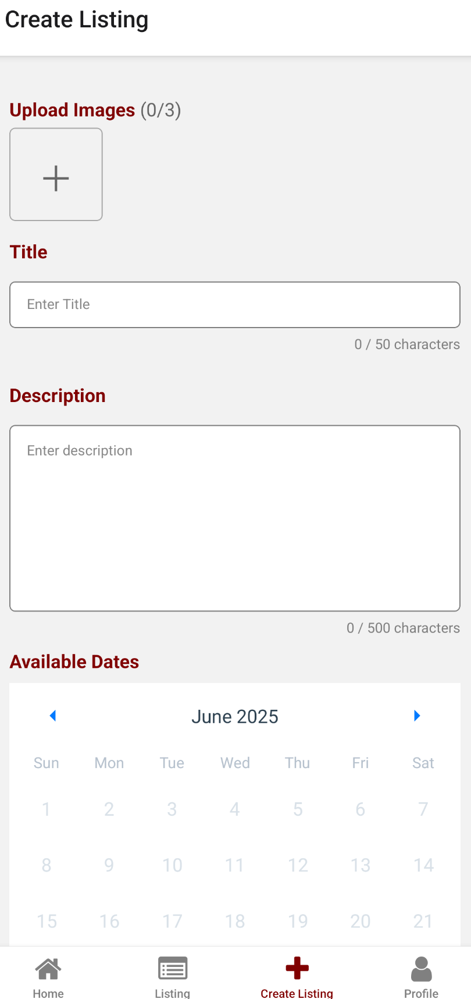

## Purpose and Key Features

The **Create Listing** screen enables users to share their home service requests or offer services to the marketplace. It supports:

- Creating new listings  
- Specifying the service type  
- Setting a price  
- Choosing the post type (Request or Service)
- Image Uploads (to be implemented)
- Selection of available dates (to be implemented, cannot be seen currently)
- Storing and updating listings in the Supabase backend

## User flow

The user navigates to the **Create Listing** screen from the app’s main tabs. Users should see a total of 7 components. The **Create Listing** page employs a ScrollView.

**Components:**  
1. Upload images
2. Enter a title  
3. Write a description  
4. Select a service type  
5. Enter a price
6. A calendar
7. Choose to post as a “Request” or “Service”  
8. Submit the listing  

The user should fill in all the text fields (refer to the next section for which inputs are needed to be filled)

After successfully filling in the required inputs, please click on the **Post** button to post the listing. Upon successful posting, the user will be redirected to the **Listing** tab.

On submission, the app validates the inputs, shows errors if needed, and saves the data to Supabase.

## User Input Fields and Validations

The listing creation form uses several custom and third-party components for a better UX.

### Images
- **Placeholder:** Plus Icon
- **No validation, can be left empty**

The users can upload a total of 3 images

### Title
- **Placeholder:** “Enter Title”  
- **Validation:** Cannot be empty  
- **Initial Value:** empty
  
The title input allow users to write down the title of their request/service. The title should not be left empty. The title should be brief and should be under 50 characters.

### Description
- **Placeholder:** “Enter description”  
- **Validation:** Cannot be empty  
- **Initial Value:**  empty

The description input allow users to share more details about their request/service. The description should not be left empty. The description input allows up to a maximum of 500 characters.

### Service Type
- **Default Value:** “Cleaning”  
- **Available Options:**  
  - Cleaning  
  - Installation  
  - Renovation  
  - Repairs  
  - Others  
- **Validation:** Must select one  

The service type allows user to select the type of service they require/offer.

### Price
- **Placeholder:** “Enter price”  
- **Validation:** Cannot be empty  

The price input allows users to share the budget/price of their request/service. The price input is associated with a dollar sign icon. (Note that for Renow, the dollar sign represents the Singaporean currency) The price should not be left empty. The price input allows up to a maximum of 10 characters. (We do not expect a home service/request that costs over a billion Singaporean dollars.)

### Post Type
- **Options:**  
  - Request  
  - Service  
- **Default:** Request  

The post type allows users to choose whether to upload their post as a request or service. Note that the posting will be uploaded on their respective marketplace tabs (Requests/Services) based on the post type that users selected.

### Error Handling
If the user tries to submit without filling in all fields (title, description, price), an error message is displayed in red.

## Backend handling with Supabase

When the user presses the **Post** button:

- **Step 1:** The app verifies that all required fields are filled in.  
- **Step 2:** It requests for the username from the global user context. 
- **Step 3:** Constructs a listing object (`Listings`) with all required fields:  
  - `user_id`  (taken from 'Users' table)
  - `title`  (text)
  - `description`  (text)
  - `price`  (text)
  - `type` (text)  
  - `request` (true/false based on Post Type)  
  - `created_at` (timestamp)
  - `images` (text array)

- **Step 4:**    
  - It inserts a new record into the “Listings” table. It will also insert the filename(`image_${Date.now()}_${index}.${extension || 'jpg'}`) as well as Uint8Array (Binary data) of the image to the **images** bucket in supabase
 
The uploading process is shown as follows:

      const base64Image = await FileSystem.readAsStringAsync(uri, {
        encoding: FileSystem.EncodingType.Base64,
      });

      const buffer = decode(base64Image);

      const extension = uri.split('.').pop();
      const fileName = `image_${Date.now()}_${index}.${extension || 'jpg'}`;

      const { data, error } = await supabase.storage
        .from('images')
        .upload(fileName, buffer, {
          contentType: 'image/jpeg', 
          upsert: true,
        });


- **Step 5:**  
  - If successful, clears the form and navigates the user back to the **Listing** tab.  
  - If there’s an error, displays an appropriate error message.

## Creating v.s. Editing

The interface for creating a listing and editing a listing are similar as they used the same code base.

However, there are some differences as follows:

For editing, the fields are pre-filled. For creating, the fields do not contain any inputs, they only contain placeholders.

For editing, the button below will state "Update". For creating, the button below will state "Post".

For editing, there is a backward navigation icon at the top of the screen beside the "Edit Listing" text, main tabs will not be present below the screen.
For creating, there is no backward navigation. However, main tabs will be present below the screen.

The different interfaces will be displayed below for user reference:

### Creating
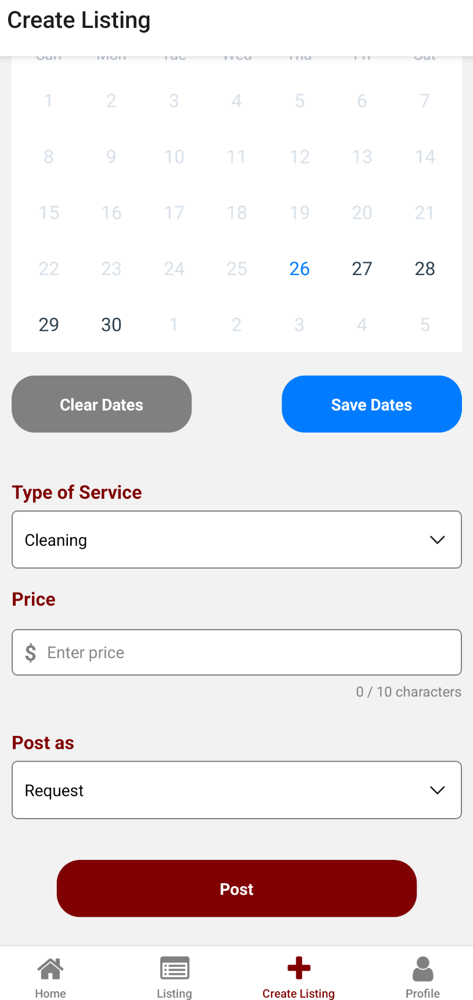

### Editing
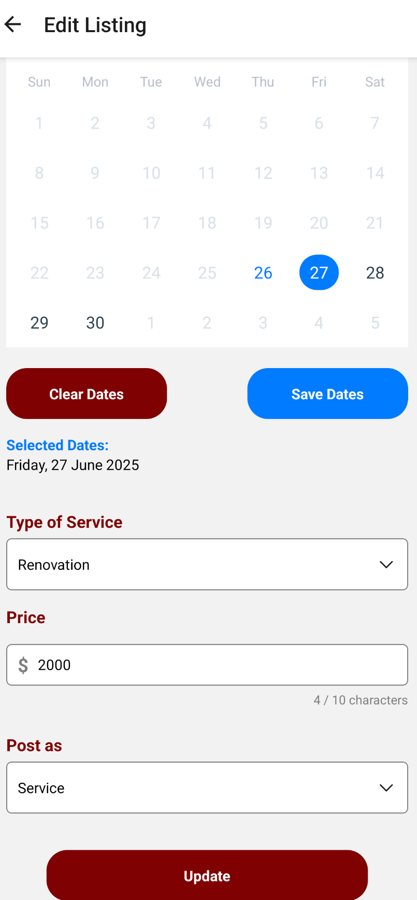
    
---

# Profile

The profile tab allows user to read more details regarding their user profile on Renow. It also comes with the **Log out** icon to enable users to log out of Renow.

The profile tab will provide the following details:
- User's completed listing
- User's review
- User's rating
- A personal calendar for users to track their schedule

The interface for the profile tab will be displayed below for user reference:
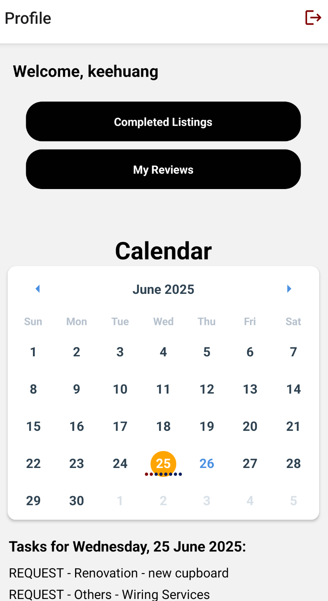

## Layout

The profile page is laid out as follows:
- A text "Welcome, {user}"
- A button for "Completed Listings"
- A button for "My Reviews"
- A personal calendar
- Details of the events on the date selected

### Completed Listings

Upon marking the listing as completed or clicking on the "Completed Listings" button. Users will be redirected to this page.

This page uses the same Item Card as the Home Tab, however, instead of "View Details" as the placeholder for the Custom button, the button will display "View Receipt" instead

The mechanism for how the item cards are displayed is the same as that in Home tab.

The interface for the listings will be displayed below for user reference:
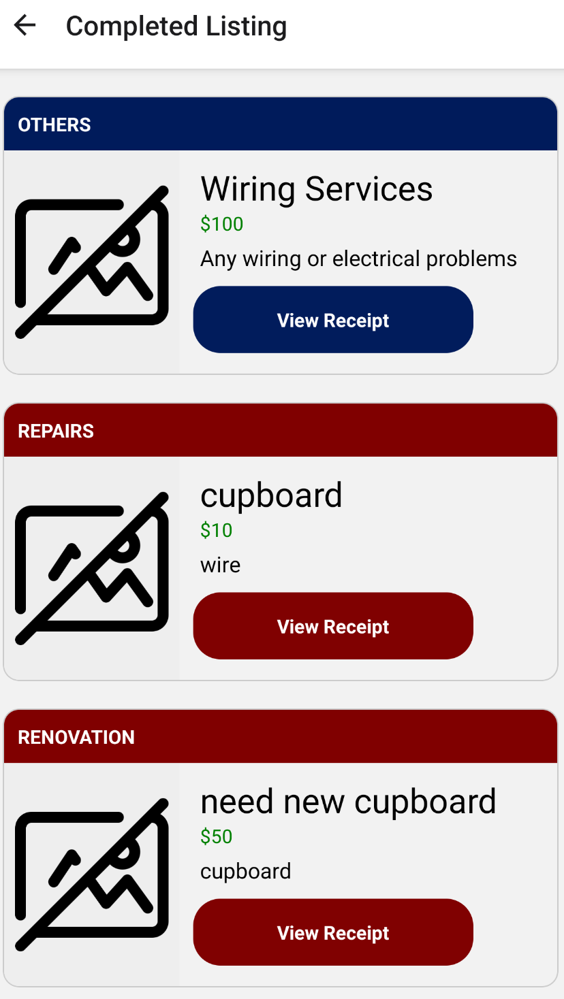

Upon clicking on "View Receipt" button, the user will be directed to a "Proof of Completion" page.

#### Proof of Completion

The Proof of Completion is a document issued by Renow that confirms that the original author of the post has marked his request/service as **Completed**

The lay out for the Proof of Completion is as follows:
- Renow Logo followed by "Proof of Completion" text
- Title of the listing
- Price which the listing is completed for
- Description of the listing
- The username of the service receiver
- The username of the service provider
- The date of completion

The interface for the layout of the Proof of Completion will be displayed below for user reference:
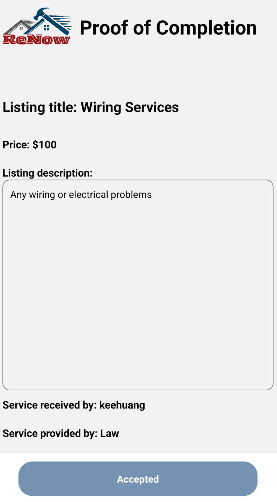

### My Reviews

Upon clicking on "My Reviews" button, a pop up modal will be displayed.

The pop up modal will show the following:

- The users' average ratings
- Past reviews of the user

The pop up modal will be displayed below for user reference:
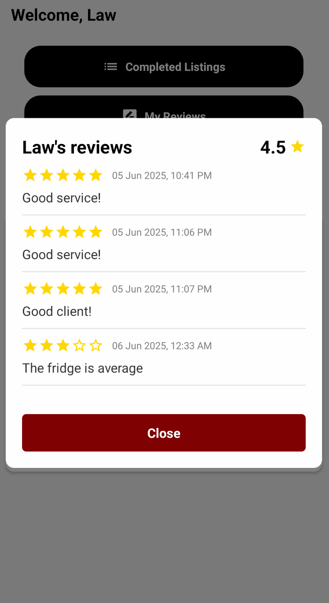

#### Reviews and Ratings

Upon entering the Proof of Completion page, users should be able to see a "Write a Review" button in Red if user has not yet written a review. Else, it will display a "Review Written" button in gray.

To write a review, users should click on the "Write a Review" button.

A pop up modal will be displayed as shown:

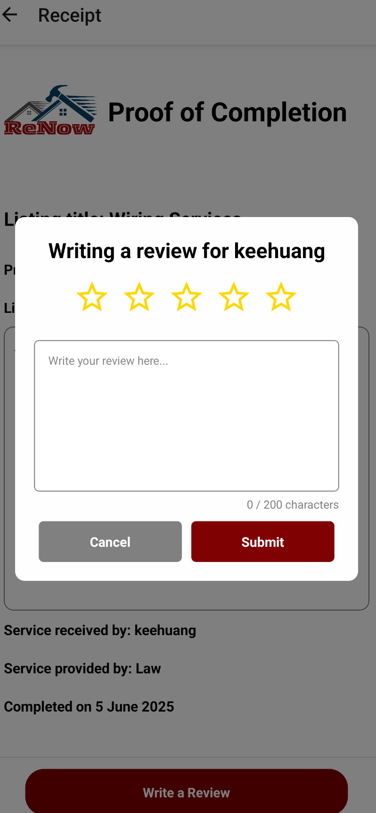

Users can provide a rating from 1 to 5 to their reviewee.

Users can also provide a short description of their experience with the reviewee.

Upon completion, please press "Submit" for the review to be logged into the database.

For users to view their own reviews, please go to "My Reviews" under the profile tab as previously mentioned.

# RenowApp Personal Calendar System

A sophisticated personal calendar system that allows users to visualize and manage their scheduled service requests and offerings in an intuitive calendar interface.

## Overview

The Personal Calendar System provides users with a comprehensive view of their scheduled activities in the RenowApp marketplace. Users can see both service requests they've accepted and services they're providing in a color-coded calendar format with detailed daily task views.

## Features

### Visual Calendar Interface
- **Monthly view**: Full month calendar display with navigation
- **Multi-dot marking**: Support for multiple events per day
- **Color-coded events**: Different colors for different activity types
- **Interactive dates**: Tap to select and view detailed information

### Task Type Differentiation
- **Service Requests**: Maroon dots for requests accepted by the user
- **Service Offerings**: Dark blue dots for user's services accepted by others
- **Multiple events**: Support for multiple tasks on the same day
- **Clear labeling**: Each task clearly labeled with type and category

### Daily Task Details
- **Date selection**: Tap any date to view tasks for that day
- **Task listing**: Detailed list of all tasks for selected date
- **Task information**: Shows task type, service category, and title
- **Empty state**: Clear indication when no tasks exist for a date

### Real-time Updates
- **Automatic refresh**: Updates when screen comes into focus
- **Pull-to-refresh**: Manual refresh capability
- **Live data**: Always shows current accepted tasks and services

## Components

### Core Components

#### `ProfileScreen.js`
Main screen containing the calendar and user interface:
- Manages calendar state and data fetching
- Handles user interactions and navigation
- Displays task details for selected dates
- Integrates with user authentication

#### `ProfileCalendar.js`
Dedicated calendar component:
- Renders the visual calendar interface
- Handles date selection and marking
- Provides customizable theming
- Supports multi-dot event marking

## Architecture

### Component Hierarchy
```
ProfileScreen
├── ProfileCalendar
├── Task Details View
├── UIButton Components
└── ReviewDisplay Modal
```

### State Management Structure

```javascript
// Calendar state
const [markedDates, setMarkedDates] = useState({});
const [selectedDate, setSelectedDate] = useState(null);
const [tasksByDate, setTasksByDate] = useState({});
const [tasksForSelectedDate, setTasksForSelectedDate] = useState([]);

// UI state
const [refreshing, setRefreshing] = useState(false);
const [review, setReview] = useState(false);

// Color constants
const SERVICE_COLOR = '#001B5B'; // Dark blue for services
const REQUEST_COLOR = 'maroon';  // Maroon for requests
```

### Data Flow
```
Database → fetchCalendarEvents → Process Data → Update Calendar
     ↓              ↓                ↓              ↓
Supabase → Filter by User → Group by Date → Render Dots
     ↓              ↓                ↓              ↓
Tasks → Build markedDates → Set State → Display Calendar
```

## Calendar Visualization

### Multi-Dot System

The calendar uses a sophisticated multi-dot system to display multiple events:

```javascript
// Example markedDates structure
{
  '2024-01-15': {
    dots: [
      { key: 'request-0', color: 'maroon' },
      { key: 'service-1', color: '#001B5B' }
    ]
  }
}
```

### Color Coding System

| Color | Type | Description |
|-------|------|-------------|
| 🔴 Maroon | REQUEST | Services requested by user and accepted by others |
| 🔵 Dark Blue | SERVICE | User's services accepted by customers |
| 🟠 Orange | Selected | Currently selected date highlight |
| 🔵 Light Blue | Today | Today's date indicator |

### Date Selection Enhancement

```javascript
// Dynamic date marking with selection
markedDates={
  selectedDate && typeof selectedDate === 'string'
    ? {
        ...markedDates,
        [selectedDate]: {
          ...(markedDates[selectedDate] || {}),
          selected: true,
          selectedColor: 'orange',
        },
      }
    : markedDates
}
```

## Data Integration

### Database Queries

#### Accepted Requests (User as Customer)
```javascript
const { data: acceptedByMe, error: error1 } = await supabase
  .from('Listings')
  .select('*')
  .eq('accepted_by', username)
  .eq('accepted', true);
```

#### User Services (User as Provider)
```javascript
const { data: myServices, error: error2 } = await supabase
  .from('Listings')
  .select('*, Users!inner(username)')
  .eq('Users.username', username)
  .eq('accepted', true);
```

### Data Processing Pipeline

```javascript
const fetchCalendarEvents = useCallback(async () => {
  // 1. Fetch user's accepted requests
  // 2. Fetch user's services accepted by others
  // 3. Process and group by date
  // 4. Build markedDates object
  // 5. Update calendar state
}, [username, selectedDate]);
```

### Date Processing

```javascript
// Convert timestamps to calendar format
const dateStr = dayjs(item.selected_date).format('YYYY-MM-DD');

// Group tasks by date
if (!dotsByDate[dateStr]) dotsByDate[dateStr] = [];
dotsByDate[dateStr].push({ 
  key: `request-${idx}`, 
  color: REQUEST_COLOR 
});
```

## State Management

### Lifecycle Management

```javascript
// Fetch data when screen comes into focus
useFocusEffect(
  useCallback(() => {
    handleRefresh();
  }, [handleRefresh])
);

// Update task details when date selection changes
useEffect(() => {
  setTasksForSelectedDate(tasksByDate[selectedDate] || []);
}, [selectedDate, tasksByDate]);
```

### Refresh Handling

```javascript
const handleRefresh = useCallback(async () => {
  setRefreshing(true);
  await fetchCalendarEvents();
  setRefreshing(false);
}, [fetchCalendarEvents]);
```

## User Interface

### Calendar Styling

```javascript
// ProfileCalendar theme configuration
theme={{
  selectedDayBackgroundColor: 'orange',
  todayTextColor: '#4A90E2',
  dotColor: '#4A90E2',
  arrowColor: '#4A90E2',
  textDayFontWeight: 'bold',
  textMonthFontWeight: 'bold',
  textDayHeaderFontWeight: 'bold',
}}
```

### Responsive Design

```javascript
// Dynamic calendar width based on screen size
calendarWidth={Dimensions.get('window').width - 40}

// Responsive styling
style={{
  width: calendarWidth,
  alignSelf: 'center',
  borderRadius: 10,
  overflow: 'hidden',
  elevation: 2,
}}
```

### Task Display Format

```javascript
// Daily task rendering
{tasksForSelectedDate.map((task, idx) => (
  <Text key={idx} style={{ fontSize: 16, marginBottom: 5 }}>
    {task.typeLabel} - {task.type} - {task.title}
  </Text>
))}
```

## Performance Features

### Optimized Data Fetching
- **Memoized callbacks**: Prevent unnecessary re-renders
- **Focused updates**: Only fetch data when screen is active
- **Efficient queries**: Targeted database queries with proper indexing

### Memory Management
- **State cleanup**: Proper cleanup of calendar state
- **Conditional rendering**: Only render task details when date is selected
- **Optimized re-renders**: useCallback and useEffect dependencies

### Loading States
- **Pull-to-refresh**: Native refresh control integration
- **Loading indicators**: Visual feedback during data fetching
- **Error handling**: Graceful error handling with console logging

## Usage

### Basic Implementation

```javascript
import ProfileCalendar from './profileTabs/ProfileCalendar';

// In your component
<ProfileCalendar
  markedDates={markedDates}
  selectedDate={selectedDate}
  onSelectDate={setSelectedDate}
  calendarWidth={Dimensions.get('window').width - 40}
/>
```

### Date Selection Handling

```javascript
// Handle date selection
onSelectDate={date => {
  if (typeof date === 'string') setSelectedDate(date);
}}
```

### Task Information Display

```javascript
// Display tasks for selected date
{selectedDate && (
  <>
    <Text style={{ fontWeight: 'bold', fontSize: 18, marginBottom: 10 }}>
      Tasks for {dayjs(selectedDate).format('dddd, DD MMMM YYYY')}:
    </Text>
    {tasksForSelectedDate.length === 0 ? (
      <Text style={{ color: 'gray' }}>No tasks for this day.</Text>
    ) : (
      // Render task list
    )}
  </>
)}
```

## Configuration

### Color Customization

```javascript
// Modify colors in ProfileScreen.js
const SERVICE_COLOR = '#001B5B'; // Dark blue for services
const REQUEST_COLOR = 'maroon';  // Maroon for requests

// Calendar theme colors in ProfileCalendar.js
theme={{
  selectedDayBackgroundColor: 'orange',
  todayTextColor: '#4A90E2',
  arrowColor: '#4A90E2',
}}
```

### Calendar Settings

```javascript
// Adjust calendar properties
markingType="multi-dot"  // Support multiple dots per date
current={selectedDate}   // Set current view date
```

### Date Formatting

```javascript
// Customize date display formats
dayjs(selectedDate).format('dddd, DD MMMM YYYY')  // Full date
dayjs(item.selected_date).format('YYYY-MM-DD')    // Calendar format
```

## Refresh Mechanisms

### Automatic Refresh
- **Focus-based**: Refreshes when user returns to screen
- **Real-time**: Always shows current data state

### Manual Refresh
- **Pull-to-refresh**: Swipe down gesture support
- **Button refresh**: Programmatic refresh capability

## User Experience Features

### Visual Feedback
- **Date highlighting**: Selected dates are highlighted in orange
- **Today indicator**: Current date is highlighted in blue
- **Multi-dot display**: Multiple events shown as separate colored dots

### Accessibility
- **Touch targets**: Adequate sizing for date selection
- **Clear labeling**: Task types clearly labeled
- **Color contrast**: High contrast colors for visibility

### Information Architecture
- **Hierarchical display**: Month → Date → Tasks
- **Clear categorization**: SERVICE vs REQUEST distinction
- **Detailed information**: Task type, category, and title

## Error Handling

```javascript
// Comprehensive error handling
if (error1 || error2) {
  console.error('Error fetching calendar events:', error1 || error2);
  setRefreshing(false);
  return;
}

// Type safety for date handling
if (date && typeof date === 'string') {
  marked[date] = { dots };
}
```

## Future Enhancements

- **Week view**: Alternative calendar layout
- **Event editing**: Modify task details from calendar
- **Reminders**: Push notifications for upcoming tasks
- **Export functionality**: Export calendar to other applications
- **Recurring events**: Support for recurring service appointments
- **Time slots**: Add specific time scheduling within dates
- **Status indicators**: Visual status for completed/pending tasks
- **Better UI**: More comprehensive visuals for pending tasks

## Dependencies

```json
{
  "react-native-calendars": "Calendar component library",
  "dayjs": "Date manipulation and formatting",
  "@react-navigation/native": "Navigation framework",
  "@supabase/supabase-js": "Database integration",
  "react-native-vector-icons": "Icon library"
}
```

## Calendar States

### Empty Calendar
- Clean monthly view with navigation arrows
- Today's date highlighted in blue
- No events marked

### Active Calendar
- Multiple colored dots on various dates
- Selected date highlighted in orange
- Clear visual distinction between event types

### Task Detail View
- Selected date with formatted display
- List of tasks with type labels
- Empty state message when no tasks exist

---

## Logging out

Users can click on the **Exit** icon at the top right side of their screen. Upon clicking the icon, the user will be prompted with a confirmation message on whether they want to log out of Renow.


If the user wishes to log out, please select **Logout**  
Otherwise, please select **Cancel**

---

# Software Engineering Practices in ReNow

## Architecture & Design Patterns

### Component-Based Architecture
- **Modular Design**: The application is structured using React Native's component-based architecture, with clear separation of concerns between screens, components, and utilities.
- **Reusable Components**: Common UI elements like `ItemCard`, `EditableItemCard`, and `FilterModal` are built as reusable components, promoting DRY (Don't Repeat Yourself) principles.
- **Custom Components**: Heavy reliance on custom components instead of native React components ensures consistent cross-platform experience.

### Navigation Architecture
- **Tab-based Navigation**: Material Top Tab Navigator and Bottom Tab Navigator provide intuitive user experience
- **Stack Navigation**: Proper screen management with stack navigation for detailed views
- **Centralized Navigation**: Clean navigation structure with proper parameter passing between screens

### State Management
- **React Hooks**: Extensive use of `useState`, `useEffect`, `useCallback`, and `useFocusEffect` for efficient state management
- **Context API**: Global user context for managing user authentication state across the application
- **Proper State Lifecycle**: Clear state initialization, updates, and cleanup

## Code Organization & Structure

### File Structure
```
ReNow/
├── screens/
│   ├── HomeScreen.js
│   ├── PostingScreen.js
│   ├── ProfileScreen.js
│   └── ListingScreen.js
├── components/
│   ├── ItemCard.js
│   ├── EditableItemCard.js
│   └── FilterModal.js
├── tabs/
│   ├── HomeRequest.js
│   ├── HomeService.js
│   └── listingTabs/
└── utils/
```

### Separation of Concerns
- **Screen Logic**: Each screen handles its own business logic and state
- **UI Components**: Presentation components are separated from business logic
- **Data Layer**: Supabase integration abstracted into reusable functions

## Error Handling & Validation

### Input Validation
- **Form Validation**: Comprehensive validation for all user inputs (username length, password requirements, required fields)
- **Real-time Validation**: Immediate feedback for invalid inputs
- **Error Messages**: Clear, user-friendly error messages for validation failures

### Exception Handling
```javascript
// Example error handling pattern
try {
  const { data, error } = await supabase.from('Listings').select('*');
  if (error) {
    console.error('Database error:', error);
    // Handle error appropriately
  }
} catch (exception) {
  console.error('Unexpected error:', exception);
}
```

### Graceful Degradation
- **Loading States**: Proper loading indicators during data fetching
- **Empty States**: Clear messaging when no data is available
- **Fallback UI**: Graceful handling of missing or corrupted data

## Performance Optimization

### Memory Management
- **Pagination**: Implementation of pagination to handle large datasets efficiently
- **Lazy Loading**: Loading data in chunks (5 items at a time) to improve performance
- **State Cleanup**: Proper cleanup of state and effects to prevent memory leaks

### Efficient Data Fetching
- **Conditional Queries**: Only fetching data when necessary
- **Memoization**: Use of `useCallback` to prevent unnecessary re-renders
- **Focus-based Updates**: Refreshing data only when screens come into focus

### Caching Strategy
- **Local State**: Effective use of local component state for temporary data
- **Database Optimization**: Efficient Supabase queries with proper filtering and sorting

### Version Control
- **Incremental Development**: Feature-based development with clear milestones
- **Branching & Pull Requests**: Allows for concurrent feature-based development with minimum side effects on other versions
- **Developer Notes**: Clear documentation for future developers

--- 

# Testing in ReNow

## User testing

We conducted testing from both client side (APK app) and Developer side (Expo Go) by going through the user flow and identifying potential bugs or obstructions that users might face

During the course of our testing, we have identified the following bugs and addressed them as follows:

### Post Spamming

Previously, before the implementaiton of the Image Upload feature, posting can be done instantly at the click of the button.

However, with the Image upload capability, posting now requires 1-2s. During this timeframe, user can repeatedly click on the Post button and re-submit their posts again. This will flood our database and marketplace with new postings and constituted a serious concern for the app.

Hence, after identifying this potential bug, we have implemented a LoadingScreen modal that restricts user movement during that posting timeframe.

Upon clicking "Post" or "Update" (if users are editing their listing), the modal will pop-up, blocking user from repeatedly clicking on the "Post" or "Update"  button.

The implementation of the Loading Screen modal is as shown below:

```javascript
import { Modal, View, ActivityIndicator, Text, StyleSheet } from 'react-native';

const LoadingScreen = ({ visible, text }) => {
  return (
    <Modal
      transparent={true}
      animationType="fade"
      visible={visible}
    >
      <View style={styles.container}>
        <View style={styles.wrapper}>
          <ActivityIndicator size="large" color="#ffffff" />
          {text && <Text style={styles.loadingText}>{text}</Text>}
        </View>
      </View>
    </Modal>
  );
};

const styles = StyleSheet.create({  
  container: { //This is for the entire loading screen background
    flex: 1,
    alignItems: 'center',
    flexDirection: 'column',
    justifyContent: 'center',
    backgroundColor: '#00000000', // 00 at the end represents opacity, users should not be able to click any other buttons during loading screen
  },
  wrapper: { //for the box where the activity indicator lies on
    backgroundColor: '#00000080', 
    height: 100,
    width: 100,
    borderRadius: 10,
    display: 'flex',
    alignItems: 'center',
    justifyContent: 'center',
  },
  loadingText: {
    marginTop: 10,
    color: '#fff',
    textAlign: 'center',
  },
});

export default LoadingScreen;
```

### Inconsistent UI between Android and IOS users

When testing using an Android emulator and Expo Go downloaded on an IOS device, we noticed that certain React Native pre-built components such as "Button" may display differently on different OS.

Hence, to standardise user experience across both Android and IOS devices, we created our own custom components such as CustomTextInput and CustomButton.

The implementation of one of our custom component, Custom Button is shown below:

```javascript
import {
  StyleSheet,
  Text,
  TouchableOpacity
} from "react-native";

const CustomButton = ({ onPress, text, color }) => {
  return (
    <TouchableOpacity onPress={onPress} style={[styles.container, { backgroundColor: color }]}>
      <Text style={styles.text}>{text}</Text>
    </TouchableOpacity>
  );
};

const styles = StyleSheet.create({
  container: {
    borderRadius: 20,
    width: '80%',
    padding: 15,
    marginVertical: 5,
    alignItems: 'center',
  },
  text: {
    color: 'white',
    fontWeight: 'bold',
  }
});

export default CustomButton;
```

## Unit testing
